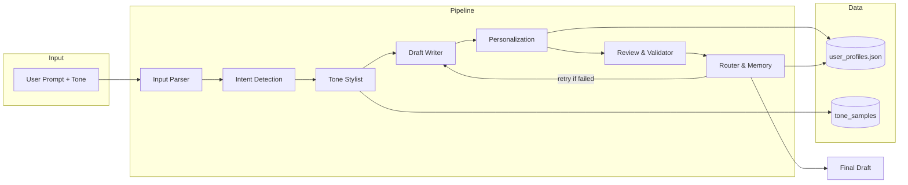

# AI-Powered Email Assistant

Capstone Project 1 for IK Agentic AI course. A multi-agent pipeline that generates, personalizes, and validates email drafts using LangGraph, Streamlit, and Pydantic.

## Architecture



Rendered diagram: see [assets/email_assistant_agent_flow.png](assets/email_assistant_agent_flow.png).

### Agents

| Agent | Function |
|-------|----------|
| Input Parsing | Validates prompt, extracts recipient, tone, constraints |
| Intent Detection | Classifies intent (outreach, follow-up, apology, info, etc.) |
| Tone Stylist | Adjusts tone using tokenized prompts and samples |
| Draft Writer | Generates subject and body with structure and clarity |
| Personalization | Injects user profile data |
| Review & Validator | Checks grammar, tone alignment, coherence |
| Router & Memory | Fallback handling, logs drafts, stores profile memory |

## Setup

### Requirements

- Python 3.11+
- OpenAI API key (required)

### Install

```bash
pip install -r requirements.txt
# Or editable install
pip install -e .
```

### Environment

Copy `.env.example` to `.env` and set:

```env
OPENAI_API_KEY=sk-your-key-here
# Optional: ANTHROPIC_API_KEY, COHERE_API_KEY for fallback
```

### Run

```bash
streamlit run email_assistant/src/ui/streamlit_app.py
```

Or with Docker:

```bash
docker build -t email-assistant .
docker run -p 8501:8501 -e OPENAI_API_KEY=sk-xxx email-assistant
```

## Configuration

Edit `config/mcp.yaml` to change:

- `primary_model` / `primary_provider` (default: gpt-4o-mini, openai)
- `fallback_model` / `fallback_provider` for retry/fallback
- `max_retries` for draft validation retries

## Project Structure

```
email_assistant/
├── src/
│   ├── agents/          # 7 agent modules
│   ├── workflow/        # LangGraph flow
│   ├── ui/              # Streamlit app
│   ├── integrations/    # LLM clients
│   ├── models/          # Pydantic schemas
│   └── memory/          # User profile store
├── data/
│   └── tone_samples/    # Tone examples
config/
├── mcp.yaml             # Model routing config
Dockerfile
README.md
```

## Deployment

- **Streamlit Cloud**: Connect the repo, set `OPENAI_API_KEY` in secrets, run `streamlit run email_assistant/src/ui/streamlit_app.py`
- **Local**: Use `streamlit run` as above
- **Docker**: Build and run with env vars for API keys
