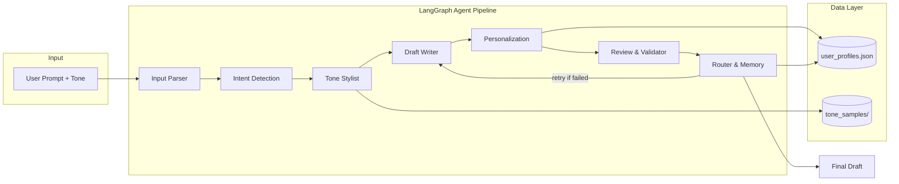

# AI-Powered Email Assistant

**Capstone Project -- Applied Agentic AI for SWEs (IK)**

A multi-agent pipeline that generates, personalizes, and validates email drafts in seconds using LangGraph orchestration, Streamlit UI, and Pydantic structured data handling.

---

## Table of Contents

- [Business Use Case](#business-use-case)
- [Architecture Overview](#architecture-overview)
- [Agent Pipeline](#agent-pipeline)
- [Agentic AI Principles](#agentic-ai-principles)
- [Technology Stack](#technology-stack)
- [Project Structure](#project-structure)
- [Setup & Installation](#setup--installation)
- [Running the Application](#running-the-application)
- [Configuration (MCP / Model Routing)](#configuration-mcp--model-routing)
- [Memory & Personalization](#memory--personalization)
- [Evaluation & Testing](#evaluation--testing)
- [Streamlit UI Walkthrough](#streamlit-ui-walkthrough)
- [Deployment](#deployment)
- [Design Decisions](#design-decisions)

---

## Business Use Case

Professionals spend 15-20 minutes per email, leading to lost productivity and inconsistent tone or quality. This assistant uses agentic AI to solve that.

| Opportunity | Impact |
|---|---|
| Productivity Boost | Reduce email drafting from 15-20 min to under 2 min |
| Context-Aware Writing | Tailor tone and intent to recipient and situation |
| Multi-Purpose | Outreach, follow-ups, apologies, info requests, internal updates |
| Scalability | Consistent, on-brand communication at team/org level |
| Memory | Learns from prior interactions for stylistic consistency |

---

## Architecture Overview


```mermaid
flowchart LR
    subgraph Input
        User[User Prompt + Tone]
    end

    subgraph Pipeline [LangGraph Agent Pipeline]
        IP[Input Parser]
        ID[Intent Detection]
        TS[Tone Stylist]
        DW[Draft Writer]
        PA[Personalization]
        RV[Review & Validator]
        RM[Router & Memory]
    end

    subgraph Data [Data Layer]
        UP[(user_profiles.json)]
        Tones[(tone_samples/)]
    end

    User --> IP
    IP --> ID
    ID --> TS
    TS --> DW
    DW --> PA
    PA --> RV
    RV --> RM
    RM -->|retry if failed| DW
    RM --> Final[Final Draft]

    PA --> UP
    RM --> UP
    TS --> Tones
```

**End-to-end flow:**

1. User enters a prompt, selects tone and optional recipient in the Streamlit UI.
2. The LangGraph pipeline runs 7 agents sequentially.
3. If the Review Agent detects issues, the Router retries the Draft Writer (up to 2 times).
4. The final draft is displayed in an editable preview with export options.
5. The interaction is logged to memory for future personalization.

---

## Agent Pipeline

Each agent is a Python class with a `run(self, state: dict) -> dict` method. Agents read from and write to a shared `EmailAssistantState` (TypedDict) that flows through the LangGraph graph.

| # | Agent | File | Reads | Writes | Uses LLM? |
|---|-------|------|-------|--------|-----------|
| 1 | **Input Parser** | `input_parser_agent.py` | `raw_prompt`, `user_tone`, `user_recipient` | `parsed_input`, `errors` | Yes (structured output) |
| 2 | **Intent Detection** | `intent_detection_agent.py` | `parsed_input`, `user_intent_override` | `intent` | Yes (classification) |
| 3 | **Tone Stylist** | `tone_stylist_agent.py` | `parsed_input`, `intent` | `tone_context` | No (template + samples) |
| 4 | **Draft Writer** | `draft_writer_agent.py` | `parsed_input`, `intent`, `tone_context`, `user_id` | `draft` | Yes (generation) |
| 5 | **Personalization** | `personalization_agent.py` | `draft`, `user_id` | `personalized_draft` | No (string ops) |
| 6 | **Review & Validator** | `review_agent.py` | `personalized_draft`, `tone_context` | `review_result` | Yes (evaluation) |
| 7 | **Router & Memory** | `router_agent.py` | `personalized_draft`, `review_result`, `retry_count`, `raw_prompt`, `user_id` | `retry_count`, `retry_reason` | No (logic + I/O) |

### Agent details

**Input Parser** -- Sends the raw prompt to the LLM with `with_structured_output()` to extract recipient, tone, constraints, and a normalized prompt. Falls back to using user inputs directly if the LLM call fails, so the pipeline never crashes at step 1.

**Intent Detection** -- Classifies the prompt into one of 6 intent types: `outreach`, `follow_up`, `apology`, `info_request`, `internal_update`, `other`. Respects user override from the UI.

**Tone Stylist** -- Maps the tone enum to a prompt instruction string (e.g., "Use a formal, respectful tone. Avoid contractions...") and loads example text from `data/tone_samples/`. The tone samples serve as **few-shot prompting** -- by showing the LLM a concrete example of the desired tone, it produces more accurate and consistent output than instructions alone. No LLM call needed -- this is a deterministic mapping that prepares context for downstream agents.

**Draft Writer** -- The core generation agent. Builds a rich prompt combining: the user's request, tone instructions from the Tone Stylist, the sender's name/company from their profile (to avoid `[Your Name]` placeholders), and the last 3 conversation turns for contextual continuity. Uses `with_structured_output()` to get a structured subject + body.

**Personalization** -- Post-processes the draft to: replace any `[Company]` placeholder with the real company name, strip leftover LLM placeholders (`[Your Name]`, `[Sender Name]`, `[Name]`, etc.), and append the user's name or custom signature at the end.

**Review & Validator** -- Asks the LLM to check grammar, tone alignment, and coherence. Returns `passed: bool`, `suggestions: list[str]`, and `issues: list[str]`. Configured to be lenient (only fails for clear errors).

**Router & Memory** -- Logs the draft summary and full conversation turn to the user's profile. Then decides: if review failed and `retry_count < max_retries`, loop back to the Draft Writer; otherwise end the pipeline.

---

## Agentic AI Principles

This project demonstrates the following agentic AI principles:

### 1. Modular Agent Decomposition
Each task (parse, classify, style, draft, personalize, review, route) is handled by a dedicated agent with a single responsibility. Agents can be evaluated, improved, or swapped independently.

### 2. Structured State Management
All data flowing through the pipeline is validated via Pydantic models (`ParsedInput`, `DraftResult`, `ReviewResult`, `UserProfile`, etc.). The LangGraph state is a TypedDict with typed keys that agents read and update.

### 3. Orchestrated Multi-Agent Collaboration
LangGraph wires agents into a directed graph with sequential edges and a conditional retry loop. The Router Agent decides at runtime whether to retry or finalize, making the system adaptive.

### 4. Tool Use & Function Calling
Four agents use LangChain's `with_structured_output()` to get Pydantic-validated responses from the LLM. This ensures reliable parsing, classification, and generation without fragile regex or string parsing.

### 5. Memory & Personalization
Conversation history (last 10 turns) persists across sessions in `user_profiles.json`. The Draft Writer injects recent turns as context so the LLM maintains stylistic consistency. User profiles store name, company, and style preferences.

### 6. Human-in-the-Loop
The Streamlit UI lets users: override tone and intent, edit the generated draft before export, manage their profile, and clear conversation history. The system generates; the human decides.

### 7. Fallback & Retry Logic
The Router Agent implements a retry loop (configurable via `max_retries` in `mcp.yaml`). If the Review Agent detects issues, the draft is regenerated. The LLM factory supports primary + fallback model configuration.

### 8. MCP / Model Routing
`config/mcp.yaml` defines primary and fallback models. The `llm_factory.py` reads this config and can route to OpenAI, Anthropic, or Cohere. Environment variable overrides are supported.

---

## Technology Stack

| Component | Technology | Purpose |
|---|---|---|
| Multi-Agent Orchestration | LangGraph | Directed graph with state, edges, conditional routing |
| Language Models | GPT-4o-mini (primary), Claude/Cohere (fallback) | Understanding and generation |
| Structured Data | Pydantic v2 | Typed schemas for all agent I/O, LLM structured output |
| Web Interface | Streamlit | Compose, edit, export emails |
| Memory Layer | JSON (user_profiles.json) | Conversation history, draft summaries, user preferences |
| LLM Integration | LangChain (ChatOpenAI, ChatAnthropic, ChatCohere) | Unified LLM interface with structured output |
| Configuration | YAML (mcp.yaml) + .env | Model routing, API keys |
| Testing | pytest + LLM-as-a-Judge | Unit tests + automated tone evaluation |
| Containerization | Docker | Reproducible deployment |

---

## Project Structure

```
ik-agentic-ai-capstone1/
├── email_assistant/
│   ├── src/
│   │   ├── agents/                        # 7 agent classes
│   │   │   ├── input_parser_agent.py      # InputParserAgent
│   │   │   ├── intent_detection_agent.py  # IntentDetectionAgent
│   │   │   ├── tone_stylist_agent.py      # ToneStylistAgent
│   │   │   ├── draft_writer_agent.py      # DraftWriterAgent
│   │   │   ├── personalization_agent.py   # PersonalizationAgent
│   │   │   ├── review_agent.py            # ReviewAgent
│   │   │   └── router_agent.py            # RouterAgent
│   │   ├── workflow/
│   │   │   └── langgraph_flow.py          # StateGraph, nodes, edges, invoke()
│   │   ├── ui/
│   │   │   └── streamlit_app.py           # Streamlit frontend
│   │   ├── integrations/
│   │   │   ├── config_loader.py           # Reads mcp.yaml
│   │   │   ├── llm_factory.py             # get_llm(), get_fallback_llm()
│   │   │   ├── openai_client.py           # ChatOpenAI wrapper
│   │   │   └── cohere_client.py           # ChatCohere wrapper (fallback)
│   │   ├── models/
│   │   │   └── schemas.py                 # All Pydantic models
│   │   └── memory/
│   │       ├── profile_store.py           # load/save/append/clear helpers
│   │       └── user_profiles.json         # Persisted user data
│   └── data/
│       └── tone_samples/                  # Example text per tone
│           ├── formal.txt
│           ├── casual.txt
│           ├── assertive.txt
│           ├── friendly.txt
│           └── professional.txt
├── tests/
│   ├── conftest.py                        # Shared fixtures
│   ├── test_schemas.py                    # 16 Pydantic model tests
│   ├── test_profile_store.py              # 9 memory layer tests
│   ├── test_tone_stylist.py               # 6 tone context tests
│   ├── test_personalization.py            # 9 personalization tests
│   └── test_eval_tone.py                  # 6 LLM-as-a-judge eval tests
├── config/
│   └── mcp.yaml                           # Model routing config
├── .env.example                           # API key template
├── .gitignore
├── requirements.txt
├── pyproject.toml
├── Dockerfile
├── generate_slides.py                     # Generates presentation .pptx
└── README.md
```

---

## Setup & Installation

### Prerequisites

- Python 3.11+
- OpenAI API key (required)
- Anthropic or Cohere API key (optional, for fallback)

### Install dependencies

```bash
pip install -r requirements.txt
```

Or as an editable package:

```bash
pip install -e .
```

### Configure environment

```bash
cp .env.example .env
```

Edit `.env` and set your API key(s):

```env
OPENAI_API_KEY=sk-your-openai-key-here

# Optional fallback models
ANTHROPIC_API_KEY=your-anthropic-key-here
COHERE_API_KEY=your-cohere-key-here
```

---

## Running the Application

### Local

```bash
streamlit run email_assistant/src/ui/streamlit_app.py
```

Opens at `http://localhost:8501`.

### Docker

```bash
docker build -t email-assistant .
docker run -p 8501:8501 -e OPENAI_API_KEY=sk-xxx email-assistant
```

---

## Configuration (MCP / Model Routing)

Edit `config/mcp.yaml`:

```yaml
primary_model: gpt-4o-mini
primary_provider: openai
fallback_model: claude-3-haiku-20240307
fallback_provider: anthropic
max_retries: 2
```

| Key | Description | Default |
|-----|-------------|---------|
| `primary_model` | Model name for main LLM calls | `gpt-4o-mini` |
| `primary_provider` | `openai`, `anthropic`, or `cohere` | `openai` |
| `fallback_model` | Fallback model (used by `get_fallback_llm()`) | `claude-3-haiku-20240307` |
| `fallback_provider` | Provider for fallback | `anthropic` |
| `max_retries` | Max retry loops when Review Agent fails a draft | `2` |

Environment variables `PRIMARY_MODEL` and `PRIMARY_PROVIDER` override the YAML values.

---

## Memory & Personalization

### User Profiles

Each user (identified by `User ID` in the sidebar) has a profile stored in `user_profiles.json`:

```json
{
  "id": "dushy",
  "name": "Dushy",
  "company": "Acme Corp",
  "style_preferences": {
    "preferred_tone": null,
    "signature": null,
    "avoid_phrases": [],
    "preferred_phrases": []
  },
  "prior_drafts": [ ... ],
  "conversation_history": [ ... ]
}
```

### Conversation Memory

Every email generation is logged as a `ConversationTurn`:

```json
{
  "prompt": "Follow up on our meeting...",
  "subject": "Follow-Up: Meeting Discussion",
  "body": "Dear John, ...",
  "intent": "follow_up",
  "tone": "professional"
}
```

- Last **10 turns** are kept per user.
- The **Draft Writer** injects the last **3 turns** into its prompt so the LLM maintains tone and style across sessions.
- Users can **clear history** via the sidebar to start fresh.

### Placeholder Safety

The Draft Writer tells the LLM the sender's actual name and explicitly instructs it not to use placeholders. As a fallback, the Personalization Agent strips common placeholders (`[Your Name]`, `[Sender Name]`, `[Name]`, etc.) and replaces them with the real name/signature.

---

## Evaluation & Testing

### Unit Tests (40 tests, no API calls required)

```bash
pytest tests/ -v --ignore=tests/test_eval_tone.py
```

| Test File | Count | What It Tests |
|-----------|-------|---------------|
| `test_schemas.py` | 16 | All Pydantic models: enums, defaults, validation, JSON round-trips |
| `test_profile_store.py` | 9 | Memory CRUD: save/load/append/clear with temp JSON fixture |
| `test_tone_stylist.py` | 6 | Tone context generation for all 5 tones |
| `test_personalization.py` | 9 | Name/signature appending, placeholder stripping, company injection, deduplication |

### LLM-as-a-Judge Evaluation (6 tests, requires API key)

```bash
pytest tests/test_eval_tone.py -v -m eval
```

These tests run the **full LangGraph pipeline** end-to-end and then use a **separate LLM call** to judge whether the generated email matches the requested tone. The judge LLM is called with **temperature 0** to ensure deterministic, reproducible evaluations.

**How it works:**

1. Generate an email through the pipeline with a specific tone (formal, casual, assertive, friendly, professional).
2. Send the generated body to a judge LLM (temperature=0 for consistency) with a structured output schema:

```python
class ToneJudgment(BaseModel):
    matches_requested_tone: bool  # Did the email match?
    detected_tone: str            # What tone did the judge detect?
    confidence: float             # 0.0 - 1.0
    reasoning: str                # Why?
```

3. Assert that `matches_requested_tone` is `True` and `confidence >= 0.5`.

**Tone consistency test:** Generates the same prompt with both `formal` and `casual` tones, then verifies the judge detects *different* tones -- confirming the pipeline actually adapts output.

Auto-skips when `OPENAI_API_KEY` is not set, so CI pipelines without credentials won't fail.

### Run all tests

```bash
pytest tests/ -v
```

---

## Streamlit UI Walkthrough

### Sidebar

- **Tone selector** -- dropdown with 5 options: formal, casual, assertive, friendly, professional
- **Intent override** -- optional dropdown to bypass automatic intent detection
- **Recipient** -- optional text field for the recipient name/email
- **User ID** -- for personalization and memory (defaults to "default")
- **Profile & Memory** (expandable):
  - Name and company fields with a Save button
  - "Clear conversation history" button to reset memory

### Main Area

- **Prompt** -- text area describing what email to write
- **Generate Email** -- triggers the full 7-agent LangGraph pipeline
- **Email Preview** -- editable subject and body fields (user can refine before exporting)
- **Export as TXT** -- download button for the final draft

---

## Design Decisions

| Decision | Rationale |
|----------|-----------|
| **LangGraph** over pure LangChain | Built-in state management, conditional edges for retry loops, and checkpointing |
| **Pydantic** for all agent I/O | Structured validation, schema-driven LLM prompts, type safety |
| **Class-based agents** | Consistent `run(self, state) -> dict` pattern across all 7 agents |
| **JSON user profiles** | Simple, spec-compliant; easily swappable to MongoDB or Postgres |
| **`with_structured_output()`** | Reliable LLM responses mapped to Pydantic models (no regex parsing) |
| **Conversation memory** | Last 10 turns persisted; last 3 injected as draft context |
| **LLM-as-a-Judge testing** | Automated tone verification using a second LLM call with structured schema |
| **MCP config (mcp.yaml)** | Primary/fallback model routing with env override support |
| **Placeholder stripping** | Dual defense: prompt instruction + post-processing replacement |
| **Tone samples as files** | Easy to extend: drop a new `.txt` file in `data/tone_samples/` to add a tone |

---

## Evaluation Criteria Mapping

Per the capstone rubric:

| Category (Weight) | How This Project Addresses It |
|---|---|
| **Functionality (30%)** | Full pipeline generates accurate, tone-aligned drafts. 5 tone modes, 6 intent types, recipient personalization, conversation context. |
| **Agentic Architecture (25%)** | 7 distinct modular agents orchestrated via LangGraph. Conditional retry loop from Router to Draft Writer. Each agent is a class with single responsibility. |
| **User Experience (20%)** | Streamlit UI with tone/intent selectors, real-time editable preview, export to TXT, profile management, clear history. |
| **Routing & MCP (10%)** | `config/mcp.yaml` defines primary/fallback models. `llm_factory.py` routes to OpenAI/Anthropic/Cohere. `max_retries` controls review loop. |
| **Innovation (10%)** | Conversation memory across sessions, LLM-as-a-Judge eval, placeholder safety net, 5 custom tone samples, class-based agent pattern. |
| **Documentation (10%)** | This README, Mermaid architecture diagram, inline docstrings, generated slide deck (`generate_slides.py`). |
